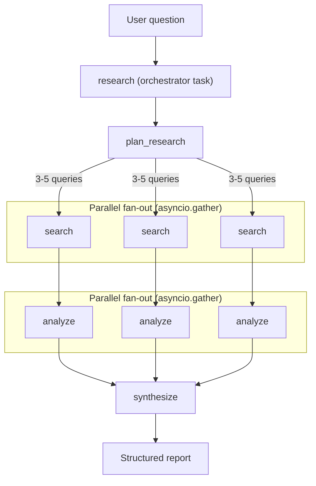
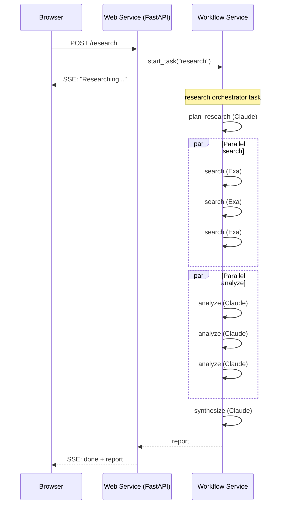

# Research Agent

[](https://render.com/deploy?repo=https://github.com/ojusave/langchain-test)

A research agent that shows how [Render Workflows](https://render.com/workflows) solve real problems in AI pipelines: automatic retries when APIs fail, isolated compute per task, durable execution across crashes, and full observability in the Dashboard.

Ask a question. The agent plans search queries, fans out parallel web searches, analyzes each result set with Claude, and synthesizes a structured report: all as chained workflow tasks that survive failures.

Built with [Render Workflows](https://render.com/workflows) + [Anthropic Claude](https://www.anthropic.com/) + [Exa](https://exa.ai/) + [LangChain](https://www.langchain.com/).

---

## Why Workflows

AI pipelines that call external APIs (LLMs, search engines, databases) are unreliable by nature. Here's what goes wrong without Workflows, and how Workflows fix each problem.

### Problem 1: a single API failure kills the entire pipeline

Without Workflows, a research pipeline runs as one long function. If Exa returns a 503 on the third search query, the entire request fails: the two successful searches and the planning step are all wasted.

```
User asks question
  → plan_research (Claude) ✓
  → search("query 1") ✓
  → search("query 2") ✓
  → search("query 3") ✗ Exa 503
  → ENTIRE REQUEST FAILS (all prior work lost)
```

**With Workflows**: each search is a separate task with its own retry config. The third search retries automatically (1s → 2s → 4s backoff). The other searches aren't affected. The pipeline completes.

### Problem 2: a slow Claude call blocks your web server

Without Workflows, the web server runs the full pipeline in-process. Synthesis can take 30-40 seconds when Claude processes five analyses. During that time, the web server thread is blocked: other users get timeouts.

**With Workflows**: the web server starts one task and returns immediately. All compute runs on the workflow service's isolated instances. The web server stays responsive.

### Problem 3: no visibility into what failed or why

Without Workflows, you get a 500 error and dig through logs. Was it the planning step? Which search query failed? Did Claude return malformed JSON?

**With Workflows**: every task run appears in the Render Dashboard as a linked task tree. You can see inputs, outputs, duration, retry history, and error messages for each individual step.

```
research (orchestrator)
├── plan_research ✓ (2.1s)
├── search "quantum computing 2025" ✓ (1.8s)
├── search "quantum error correction" ✓ (2.3s)
├── search "quantum supremacy updates" ✗→✓ (retry 1: 3.1s)
├── analyze ✓ (8.2s)
├── analyze ✓ (7.9s)
├── analyze ✓ (9.1s)
└── synthesize ✓ (12.4s)
```

### Problem 4: the server restarts and progress is lost

Without Workflows, if the web server restarts mid-pipeline (deploy, OOM, crash), everything in-flight disappears. The user sees a broken connection and has to start over.

**With Workflows**: the orchestrator task is durable. If the workflow service restarts, the Render runtime resumes execution from the last completed step. Already-completed subtasks don't re-run.

### Problem 5: you can't right-size compute per step

Without Workflows, every step runs on the same server with the same resources. Planning (tiny prompt, fast response) gets the same CPU/memory as synthesis (huge context, slow response).

**With Workflows**: each task declares its own compute plan. Planning runs on a starter instance (0.5 CPU, 512 MB). Synthesis runs on a standard instance (1 CPU, 2 GB). You pay for what each step actually needs.

---

## How It Works

The `research` orchestrator task chains four subtasks. Every box below is a separate task run: independently provisioned, retriable, and visible in the Dashboard.



The orchestrator uses `asyncio.gather` for parallel fan-out, matching the pattern from [Render's docs on chaining parallel runs](https://render.com/docs/workflows-defining#parallel-runs):

```python
@app.task
async def research(question: str) -> dict:
    plan = await plan_research(question)
    search_results = await asyncio.gather(*[search(q) for q in plan["queries"]])
    analyses = await asyncio.gather(*[analyze(s["query"], s["results"]) for s in search_results])
    return await synthesize(question, list(analyses))
```

---

## Per-Task Configuration

Each task declares its own compute plan, timeout, and retry strategy. This is where Workflows add the most value: every config decision maps to a real failure mode.

| Task | Plan | Timeout | Retries | Backoff | Why |
|---|---|---|---|---|---|
| `research` | starter | 300s | 1 × 5s | flat | Orchestrator only: awaits subtasks, no local compute. Long timeout covers the full pipeline. |
| `plan_research` | starter | 45s | 2 × 2s | 1.5× | Lightweight Claude call. Retries handle rate limits (429s). |
| `search` | starter | 30s | 3 × 1s | 2× | I/O-bound Exa API call. 3 retries with exponential backoff (1s → 2s → 4s) because network failures are transient. |
| `analyze` | standard | 60s | 2 × 2s | 1.5× | Heavier Claude call processing ~10 KB of search results. Standard plan for more memory. |
| `synthesize` | standard | 90s | 1 × 3s | flat | Heaviest Claude call: all analyses concatenated. 1 retry because input is deterministic. |

**starter** = 0.5 CPU, 512 MB. **standard** = 1 CPU, 2 GB.

The config lives directly in each task file (e.g. `tasks/search.py`) with comments explaining the rationale. There are no hidden defaults.

---

## Architecture



Two Render services:

- **Web service** (`research-agent`): thin FastAPI layer that serves the UI, starts the `research` orchestrator task via the Render SDK, and streams the result back via SSE. Does no research work.
- **Workflow service** (`research-agent-workflow`): defines five tasks (`research`, `plan_research`, `search`, `analyze`, `synthesize`). The `research` task chains the other four. Each chained call spawns a separate task run on its own compute instance.

---

## Deploy

Click the **Deploy to Render** button above. You'll be prompted to set:

- `RENDER_API_KEY`: your [Render API key](https://render.com/docs/api#1-create-an-api-key) (for the web service to trigger workflows)
- `ANTHROPIC_API_KEY`: your [Anthropic API key](https://console.anthropic.com/) (for the workflow service)
- `EXA_API_KEY`: your [Exa API key](https://exa.ai/) (for the workflow service)

Then click **Apply**. The Blueprint creates both services automatically.

Don't have a Render account? [Sign up here](https://render.com/register).

## Environment Variables

### Web service

| Variable | Required | Default | Description |
|---|---|---|---|
| `RENDER_API_KEY` | Yes | — | Render API key for triggering workflows |
| `WORKFLOW_SLUG` | No | `research-agent-workflow` | Workflow service slug |

### Workflow service

| Variable | Required | Default | Description |
|---|---|---|---|
| `ANTHROPIC_API_KEY` | Yes | — | Anthropic API key |
| `EXA_API_KEY` | Yes | — | Exa API key for web search |
| `ANTHROPIC_MODEL` | No | `claude-sonnet-4-20250514` | Claude model to use |
| `AGENT_TEMPERATURE` | No | `0.3` | LLM temperature |

## Project Structure

```
├── main.py                  # FastAPI web service (thin HTTP layer)
├── pipeline/
│   ├── __init__.py          # Exports run_pipeline
│   └── orchestrator.py      # Starts workflow task, streams SSE to browser
├── tasks/
│   ├── __init__.py          # Combines task apps into one Workflows entry point
│   ├── __main__.py          # Workflow service entry point (python -m tasks)
│   ├── llm.py               # Shared Claude helpers (ask, parse_json)
│   ├── research.py          # Orchestrator: chains all subtasks
│   ├── plan.py              # plan_research: generates search queries via Claude
│   ├── search.py            # search: Exa web search with 3 retries
│   ├── analyze.py           # analyze: extracts findings from results via Claude
│   └── synthesize.py        # synthesize: merges analyses into final report
├── static/
│   └── index.html           # Research UI
├── render.yaml              # Render Blueprint (web + workflow services)
├── requirements.txt         # Python dependencies
└── .env.example             # Environment variable reference
```

## API

### `POST /research`

Server-Sent Events endpoint. Starts the research workflow and streams status + the final report.

Request:

```json
{
  "question": "What are the latest advances in quantum computing?"
}
```

SSE events:

```
event: status
data: {"message": "Starting research..."}

event: status
data: {"message": "Researching...", "task_run_id": "tr-abc123"}

event: done
data: {"report": {"title": "...", "summary": "...", "sections": [...], "sources": [...]}}
```

### `GET /health`

Returns `{ "status": "ok" }`.
