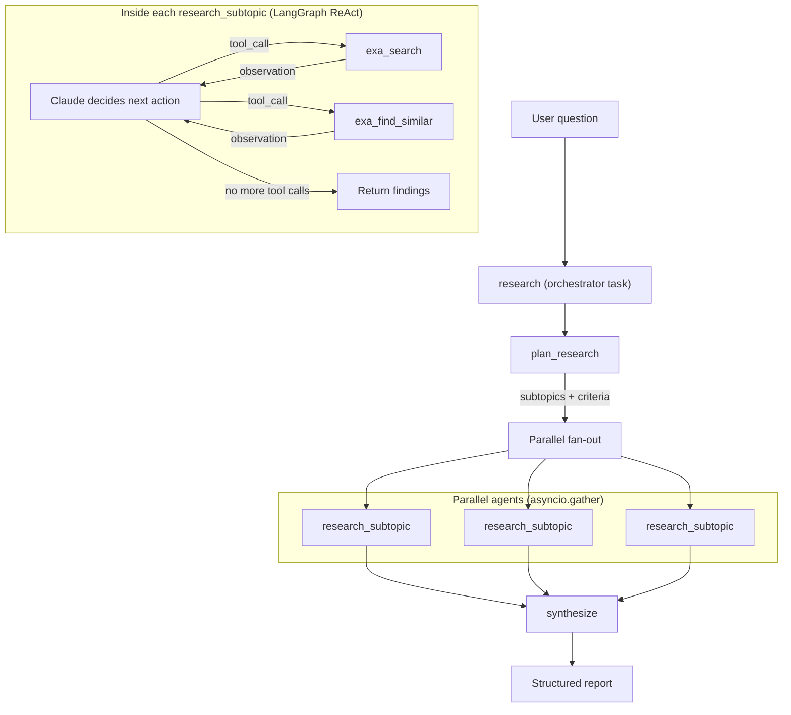
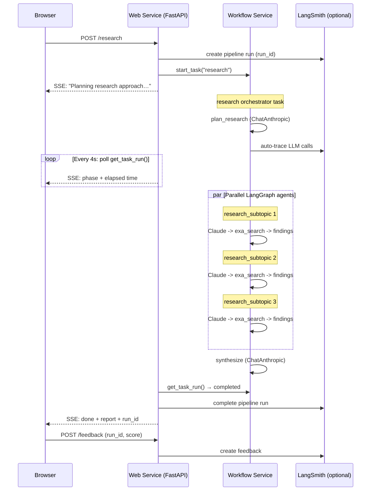

# Research Agent

[](https://render.com/deploy?repo=https://github.com/ojusave/langchain-test)

A deep research agent where three tools each do what they're best at:

- **[LangGraph](https://www.langchain.com/langgraph)** runs a ReAct agent loop: Claude dynamically decides what to search, evaluates results, and searches again or stops. The search strategy is non-deterministic and impossible to hardcode.
- **[Render Workflows](https://render.com/workflows)** provides durable orchestration: parallel research agents on isolated compute with automatic retries, per-task timeouts, and full observability in the Dashboard.
- **[Exa](https://exa.ai/)** provides AI-native semantic search as LangGraph tools: the agent queries with natural language and gets meaning-matched results, not SEO-optimized links.
- **[LangSmith](https://smith.langchain.com/)** (optional) traces every LLM call and collects user feedback via thumbs up/down ratings.

Ask a question. The agent breaks it into 3 focused subtopics, dispatches a LangGraph research agent per subtopic in parallel, and synthesizes a structured report with sources. The UI streams live progress with a step indicator and elapsed timer.

---

## How It Works



The orchestrator (a Render Workflow task) chains three phases:

```python
@app.task
async def research(question: str) -> dict:
    plan = await plan_research(question)              # Claude breaks question into subtopics
    findings = await asyncio.gather(                   # Parallel LangGraph agents
        *[research_subtopic(st["topic"], st["criteria"]) for st in plan["subtopics"]]
    )
    return await synthesize(question, list(findings))  # Claude merges into report
```

Each `await` dispatches a separate Workflow task on its own compute instance.

All Claude calls go through a shared `ChatAnthropic` model instance in `tasks/llm.py`: one way to talk to Claude, one place for model config.

---

## Why Three Layers

Each tool solves a problem the others can't.

### Why LangGraph (not a hardcoded pipeline)

A research question like "What are the latest advances in quantum computing?" can't be answered with a fixed number of searches. The agent might:

1. Search "quantum computing breakthroughs 2025" and get good results
2. Search "quantum error correction progress" and find sparse results
3. Refine to "topological qubits recent papers" and find a great source
4. Use `find_similar` on that source to discover related work
5. Decide it has enough evidence and return findings

That's 4 searches. A different question might need 2 or 7. **LangGraph's ReAct loop lets Claude decide the search strategy at runtime.** A hardcoded `for query in queries: search(query)` pipeline can't do this.

### Why Render Workflows (not one long function)

When you run 3 LangGraph agents in parallel, each making multiple Claude + Exa calls:

- **A single Exa 503 shouldn't kill the whole pipeline.** Each agent task has its own retry config (3s base, 2x backoff). Other agents are unaffected.
- **A slow agent shouldn't block your web server.** Each agent runs on its own compute instance. The web server starts one task and returns immediately.
- **You need to see what happened.** The Render Dashboard shows the full task tree: which subtopic's agent failed, what it searched, how many retries it took.
- **A server restart shouldn't lose progress.** The orchestrator is durable: already-completed subtasks don't re-run.

### Why Exa (not generic search)

The LangGraph agent queries with natural language: "fascinating recent breakthroughs in quantum error correction". Exa's neural search returns meaning-matched results. Google would return SEO-optimized listicles. `ExaFindSimilarResults` enables discovery chains: "find pages similar to this great paper I found."

---

## What Each Tool Does

| Step | Tool | What happens | Config |
|---|---|---|---|
| **Plan** | ChatAnthropic | Single Claude call: break question into 3 focused subtopics with success criteria | starter, 45s, 2 retries |
| **Research** (per subtopic) | LangGraph + Exa | ReAct agent loop: Claude calls `exa_search` / `exa_find_similar` until it has 2-3 good sources. Typically 1-2 searches per subtopic. | standard, 120s, 2 retries |
| **Synthesize** | ChatAnthropic | Single Claude call: merge all findings into a structured report | standard, 90s, 1 retry |
| **Orchestrate** | Render Workflows | Chain the above, fan out research agents in parallel | starter, 600s, 1 retry |

---

## Architecture



Two Render services:

- **Web service** (`research-agent`): thin FastAPI layer. Serves the UI, starts the orchestrator task, polls for completion every 4 seconds, and streams live progress + the final report via SSE. Also handles feedback submission.
- **Workflow service** (`research-agent-workflow`): four tasks. The `research` orchestrator chains `plan_research`, 3 parallel `research_subtopic` agents, and `synthesize`. Each task run gets its own compute instance.

---

## LangSmith Integration (Optional)

Set `LANGCHAIN_API_KEY` to enable:

- **Auto-tracing**: every ChatAnthropic and LangGraph call appears in the LangSmith dashboard with token counts, latency, and tool call details
- **Pipeline tracking**: each research request creates a root run with question in / report out
- **User feedback**: thumbs up/down buttons in the UI submit ratings to LangSmith, linked to the pipeline run

All LangSmith code is env-driven and isolated in dedicated files. To disable: unset `LANGCHAIN_API_KEY`. To remove entirely: delete `feedback.py`, `pipeline/tracking.py`, and a few import lines.

---

## Dashboard Task Tree

When a research job runs, the Render Dashboard shows:

```
research (orchestrator)                    starter  600s
├── plan_research                          starter   45s   ✓ 12s
├── research_subtopic "quantum hardware"   standard 120s   ✓ 25s (1 search)
├── research_subtopic "error correction"   standard 120s   ✗→✓ retry 1: 20s
├── research_subtopic "quantum software"   standard 120s   ✓ 18s (1 search)
└── synthesize                             standard  90s   ✓ 30s
```

Every task run shows inputs, outputs, duration, retry history, and error messages. You can see exactly which subtopic's agent failed, what it searched, and why.

---

## Deploy

This app requires two Render services: a **web service** (created by the Blueprint) and a **workflow service** (created manually in the Dashboard).

### Step 1: Deploy the web service

Click the **Deploy to Render** button above. You'll be prompted to set:

- `RENDER_API_KEY`: your [Render API key](https://render.com/docs/api#1-create-an-api-key) (for the web service to trigger workflows)

Click **Apply**. The Blueprint creates the web service.

### Step 2: Create the workflow service

Render Workflows are not yet supported in Blueprint files, so you'll create the workflow service manually:

1. In the [Render Dashboard](https://dashboard.render.com), click **New** > **Workflow**
2. Connect the same GitHub repo
3. Set **Build Command**: `pip install -r requirements.txt`
4. Set **Start Command**: `python -m tasks`
5. Set the following environment variables:
   - `ANTHROPIC_API_KEY` (required): your [Anthropic API key](https://console.anthropic.com/)
   - `EXA_API_KEY` (required): your [Exa API key](https://exa.ai/)
   - `ANTHROPIC_MODEL` (optional, default `claude-sonnet-4-20250514`)
   - `AGENT_TEMPERATURE` (optional, default `0.3`)
   - `LANGCHAIN_API_KEY` (optional): your [LangSmith API key](https://smith.langchain.com/) for tracing
   - `PYTHON_VERSION`: `3.12.3`
6. Name the service `research-agent-workflow` (this matches the default `WORKFLOW_SLUG`)
7. Click **Create Workflow**

The web service will automatically discover the workflow service by its slug.

Don't have a Render account? [Sign up here](https://render.com/register?utm_source=github&utm_medium=referral&utm_campaign=ojus_demos&utm_content=readme_link).

## Environment Variables

### Web service

| Variable | Required | Default | Description |
|---|---|---|---|
| `RENDER_API_KEY` | Yes | — | Render API key for triggering workflows |
| `WORKFLOW_SLUG` | No | `research-agent-workflow` | Workflow service slug |
| `LANGCHAIN_API_KEY` | No | — | LangSmith API key (enables tracing + feedback) |
| `LANGCHAIN_TRACING_V2` | No | `true` | Enable LangSmith tracing |
| `LANGCHAIN_PROJECT` | No | `research-agent` | LangSmith project name |

### Workflow service

| Variable | Required | Default | Description |
|---|---|---|---|
| `ANTHROPIC_API_KEY` | Yes | — | Anthropic API key |
| `EXA_API_KEY` | Yes | — | Exa API key for web search |
| `ANTHROPIC_MODEL` | No | `claude-sonnet-4-20250514` | Claude model |
| `AGENT_TEMPERATURE` | No | `0.3` | LLM temperature |
| `LANGCHAIN_API_KEY` | No | — | LangSmith API key (enables auto-tracing) |
| `LANGCHAIN_TRACING_V2` | No | `true` | Enable LangSmith tracing |
| `LANGCHAIN_PROJECT` | No | `research-agent` | LangSmith project name |

## Project Structure

```
├── main.py                      # FastAPI web service (thin HTTP layer)
├── feedback.py                  # POST /feedback endpoint (LangSmith user ratings)
├── pipeline/
│   ├── __init__.py              # Exports run_pipeline
│   ├── orchestrator.py          # Starts workflow task, polls progress, streams SSE
│   └── tracking.py              # LangSmith pipeline run tracking (optional)
├── tasks/
│   ├── __init__.py              # Combines task apps into one entry point
│   ├── __main__.py              # Workflow service entry point (python -m tasks)
│   ├── llm.py                   # Shared ChatAnthropic model + helpers
│   ├── tools.py                 # Exa tools for LangGraph (search, find_similar)
│   ├── agent.py                 # LangGraph ReAct agent (Claude + Exa tools)
│   ├── research_agent.py        # Workflow task wrapping the LangGraph agent
│   ├── plan.py                  # plan_research: subtopics via ChatAnthropic
│   ├── synthesize.py            # synthesize: merge findings via ChatAnthropic
│   └── research.py              # Orchestrator: chains plan -> agents -> synthesize
├── static/
│   └── index.html               # Research UI (light/dark mode)
├── render.yaml                  # Render Blueprint (web service)
├── requirements.txt             # Python dependencies
└── .env.example                 # Environment variable reference
```

## API

### `POST /research`

Server-Sent Events endpoint. Starts the research workflow and streams status + the final report.

Request:

```json
{
  "question": "What are the latest advances in quantum computing?"
}
```

SSE events:

```
event: status
data: {"message": "Planning research approach…", "task_run_id": "trn-abc123", "elapsed": 0}

event: status
data: {"message": "Searching for sources…", "elapsed": 12}

event: status
data: {"message": "Analyzing findings…", "elapsed": 28}

event: status
data: {"message": "Synthesizing final report…", "elapsed": 52}

event: done
data: {"report": {"title": "...", "summary": "...", "sections": [...], "sources": [...]}, "run_id": "...", "elapsed": 68}
```

### `POST /feedback`

Submit user feedback on a research result. Requires LangSmith to be configured.

Request:

```json
{
  "run_id": "uuid-from-done-event",
  "score": 1,
  "comment": "Great report"
}
```

### `GET /health`

Returns `{ "status": "ok" }`.
