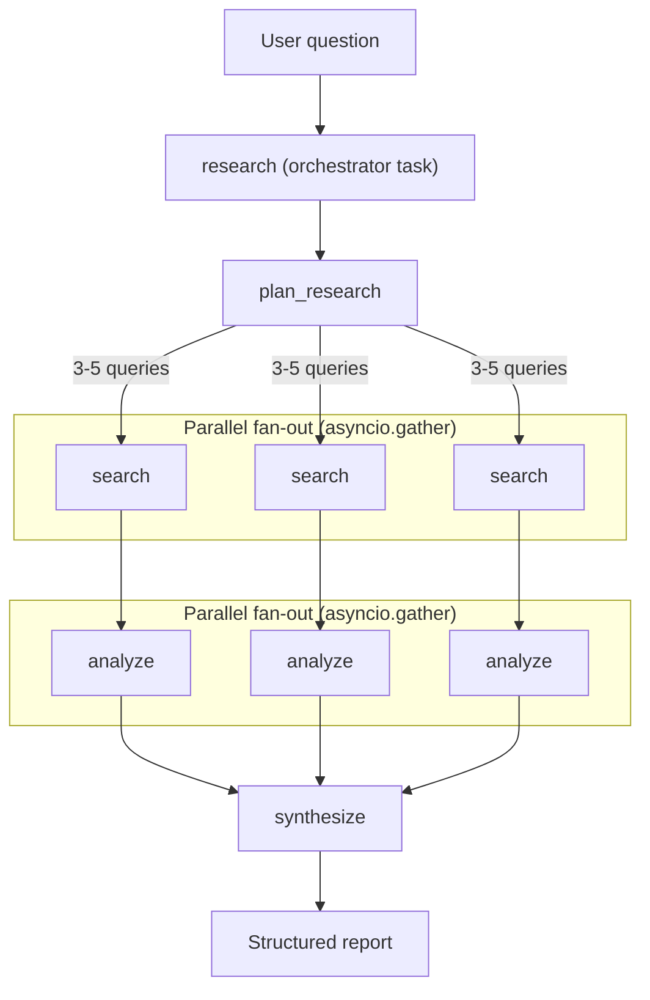
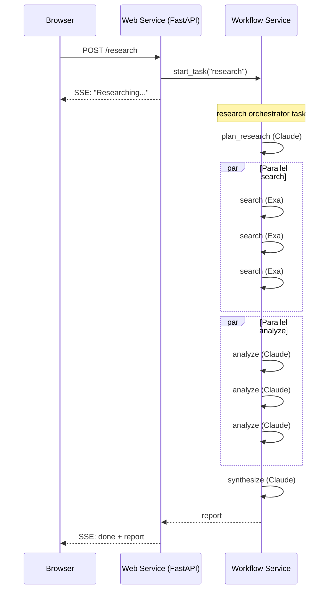

# Research Agent

[](https://render.com/deploy?repo=https://github.com/ojusave/langchain-test)

A research agent built on [Render Workflows](https://render.com/workflows). Ask a question and the agent plans search queries, fans out parallel web searches, analyzes each result set, and synthesizes a structured report with sources: all as **chained workflow tasks** with automatic retries, isolated compute, and full observability in the Render Dashboard.

Built with LangChain + Anthropic Claude + [Exa](https://exa.ai/) + [Render Workflows](https://render.com/workflows).

## How It Works

The `research` orchestrator task chains four subtasks using the Render SDK's [task chaining](https://render.com/docs/workflows-defining#chaining-task-runs) pattern. Every box below is a separate task run: independently provisioned, retriable, and visible in the Dashboard as a linked task tree.



The orchestrator uses `asyncio.gather` for parallel fan-out, matching the pattern from [Render's docs on chaining parallel runs](https://render.com/docs/workflows-defining#parallel-runs):

```python
@app.task
async def research(question: str) -> dict:
    plan = await plan_research(question)
    search_results = await asyncio.gather(*[search(q) for q in plan["queries"]])
    analyses = await asyncio.gather(*[analyze(s["query"], s["results"]) for s in search_results])
    return await synthesize(question, list(analyses))
```

## Deploy

Click the **Deploy to Render** button above. You'll be prompted to set:

- `RENDER_API_KEY`: your [Render API key](https://render.com/docs/api#1-create-an-api-key) (for the web service)
- `ANTHROPIC_API_KEY`: your Anthropic API key (for the workflow service)
- `EXA_API_KEY`: your [Exa API key](https://exa.ai/) (for the workflow service)

Then click **Apply**. The Blueprint creates both services automatically.

Don't have a Render account? [Sign up here](https://render.com/register).

## Architecture



Two Render services:

- **Web service** (`research-agent`): thin FastAPI layer that serves the UI, starts the `research` orchestrator task via the Render SDK, and streams the result back via SSE
- **Workflow service** (`research-agent-workflow`): defines five tasks (`research`, `plan_research`, `search`, `analyze`, `synthesize`). The `research` task chains the other four. Each chained run gets its own compute instance.

The web service does no orchestration: it starts one task and awaits the result. All pipeline logic (sequencing, fan-out, fan-in) lives inside the workflow, where it's durable and retriable.

## Environment Variables

### Web service

| Variable | Required | Default | Description |
|---|---|---|---|
| `RENDER_API_KEY` | Yes | - | Render API key for triggering workflows |
| `WORKFLOW_SLUG` | No | `research-agent-workflow` | Workflow service slug |

### Workflow service

| Variable | Required | Default | Description |
|---|---|---|---|
| `ANTHROPIC_API_KEY` | Yes | - | Your Anthropic API key |
| `EXA_API_KEY` | Yes | - | Your Exa API key for web search |
| `ANTHROPIC_MODEL` | No | `claude-sonnet-4-20250514` | Model to use |
| `AGENT_TEMPERATURE` | No | `0.3` | LLM temperature |

## Project Structure

```
├── main.py                  # FastAPI web service (routes + static files)
├── pipeline/
│   ├── __init__.py          # Exports run_pipeline
│   └── orchestrator.py      # Starts research task, streams result via SSE
├── tasks/
│   ├── __init__.py          # Combines task apps (workflow entry point)
│   ├── __main__.py          # python -m tasks
│   ├── llm.py               # Claude helpers shared across tasks
│   ├── research.py          # Orchestrator: chains all subtasks
│   ├── plan.py              # plan_research: generates search queries
│   ├── search.py            # search: Exa web search
│   ├── analyze.py           # analyze: extracts findings from results
│   └── synthesize.py        # synthesize: merges analyses into report
├── static/
│   └── index.html           # Research UI with Dashboard link
├── render.yaml              # Render Blueprint (web + workflow)
├── requirements.txt         # Python dependencies
└── .env.example             # Environment variable reference
```

## API

### `POST /research`

Server-Sent Events endpoint. Starts the research workflow and streams status + the final report.

Request:

```json
{
  "question": "What are the latest advances in quantum computing?"
}
```

SSE events:

```
event: status
data: {"message": "Starting research..."}

event: status
data: {"message": "Researching...", "task_run_id": "tr-abc123"}

event: done
data: {"report": {"title": "...", "summary": "...", "sections": [...], "sources": [...]}}
```

### `GET /health`

Returns `{ "status": "ok" }`.
